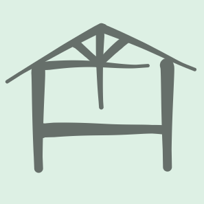

# works-sprig

__Under development:__

- [ ] api
- [ ] web/PC
- [ ] web/SP

<!-- EXTERNAL LINK -->
[demo]: --TODO
[docker]: https://docs.docker.com/get-docker/
[how to email]: https://github.com/satu-n/study-actix-web-simple-auth-server#using-sparkpost-to-send-registration-email
[movie]: --TODO
[tips]: https://github.com/satu-n/tips

<!-- INTERNAL LINK -->
[placeholder]: web/_init/src/Page/App/placeholder.txt

## What's this

Sprig the Task Breaker ⚡

[movie][movie]

### Demo

[demo][demo]

### Feature

* 
* 
* 

## How to use

### Input syntax

See input area [placeholder][placeholder].

### Shortcuts


| Icon | Shortcut | Operation |
| :---: | ---: |---|
|  |  | __INPUT__ |
|  | `/` | focus input area |
|  | `Ctrl` + `↓` | maximize input area |
|  | `Ctrl` + `Enter` | submit |
|  | `Ctrl` + `↑` | minimize input area |
|  | `Esc` | blur input area |
|  |  | __CURSOR__ |
|  | `J` `K` | down & up cursor |
|  | `X` | select task at cursor |
|  | `S` | Star task at cursor |
|  | `F` | Focus task at cursor: view directly related tasks |
|  | `U` | open URL link of task at cursor |
|  |  | __SELECTION__ |
|  | `I` | Invert selection |
|  | `E` | Execute and archive selected tasks |
|  | `Shift` + `E` | revert selected tasks |
|  | `C` | Clone selected tasks to input area |
|  | `P` | show critical Path between 2 selected tasks  |
|  |  | __VIEW__ |
|  | `1` .. `5` | time scale |
|  | `W` `O` | time shift |
|  | `A` | Archives |
|  | `R` | Roots, no successor |
|  | `L` | Leaves, no predecessor |
|  | `H` | Home |

### Logout

Click username.

## How to run locally

Prerequisites:

* [Docker & Docker Compose][docker]
* git
* bash

Enter the command as follows to access http://localhost:8080

```bash
```

<!-- ```bash
APP_NAME='my_sprig' &&
git clone https://github.com/satu-n/works-sprig.git $APP_NAME &&
cd $APP_NAME &&
bash init.sh -p $APP_NAME \
'***new!database!password***' &&
unset APP_NAME &&
docker-compose up -d &&
docker-compose logs -f
``` -->

Configure 2 '`single quoted params`'.

`-p` option means Personal use.

`APP_NAME` is now registered as the default user:

* Email: `APP_NAME`
* Password: `APP_NAME`

```bash
docker-compose down
```

to exit the app.
Your data will be retained.

```bash
docker-compose up -d
```

to resume the app.

## Thank you for reading!

See also [my dev tips][tips] if you like.
